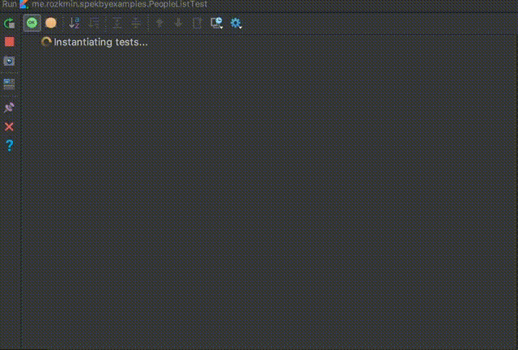
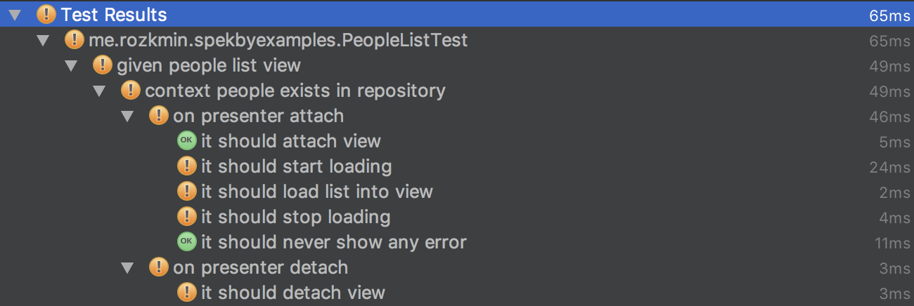

# Testing Model-View-Presenter with Spek

As we can read on Spek website, Spek is:
>A Kotlin Specification Framework for the JVM

Your unit tests answers the following question:
 
What **it** should do **on** action in **given** situation?

Spek helps you build answers for this question!

```kotlin
on("presenter detach"){
    presenter.detach()
    it("should dispose observables"){
        //
    }
}
```

And it can be displayed really nicely in Intellij/AS




## Adding and configuring Spek in project

I like to keep gradle artifacts and versions in separate file:

testDependencies.gradle:
```groovy
ext {

    def JunitVersion = '4.12'
    def KotlinMockitoVersion = '1.5.0'
    def SpekVersion = "1.1.5"

    unitTestDependencies = [
            junit      : "junit:junit:${JunitVersion}",
    ]

    kotlinTestDependencies = [
            kotlinMockito: "com.nhaarman:mockito-kotlin:${KotlinMockitoVersion}",
    ]

    spekDependencies = [
            spekApi: "org.jetbrains.spek:spek-api:${SpekVersion}",
            platformEngine: "org.jetbrains.spek:spek-junit-platform-engine:${SpekVersion}",
            junitPlatformRunner: "org.junit.platform:junit-platform-runner:1.0.0"
    ]
}
```

And attach them in module-level build.gradle file like that:
```groovy
dependencies {
    (...)
    testImplementation unitTestDependencies.values()
    testImplementation spekDependencies.values()
    testImplementation kotlinTestDependencies.values()
}
```

**testImplementation** means that those libraries will be accessible only in test builds.

## Building test suite for MVP

Our task is to create screen with simple list of people and progress indicator.

Loading people list from API or database is considered as **long running operation**, 
so we will display some progress indicator.

This functionality behaviour can be described like this:

* user enters people list screen
* when loading starts, user sees progress bar
* list is displayed on screen
* progress bar becomes invisible
* if there is error, user should be notified about it

### View contract:

The abstraction over this screen behavior can be presented in view contract:

```kotlin
interface PeopleListContract {
    interface View {
        fun addPeople(people: List<Person>)
        fun showError(throwable: Throwable = Throwable())
        fun showLoading()
        fun hideLoading()
    }

    interface Presenter {
        fun attach(view: View)
        fun detach()
    }
}
```

Before we start implementing our presenter, let's start with **test specification**:

```kotlin
import org.jetbrains.spek.api.Spek
import org.jetbrains.spek.api.dsl.*
import org.junit.platform.runner.JUnitPlatform
import com.nhaarman.mockito_kotlin.*
import org.junit.runner.RunWith

@RunWith(JUnitPlatform::class)
object PeopleListTest : Spek({
    given("people exists in repository"){
        val view: PeopleListContract.View = mock()    
    }
})
```

We mocked our view with mockito extensions for kotlin - check this link for additional resources:

https://github.com/nhaarman/mockito-kotlin

It will be useful with mocking method calls.

Now we can rewrite user story to specification:

```kotlin
on("presenter attach") {
    presenter.attach(view)
    it("should attach view") {
        assertNotNull(presenter.view)
    }
    it("should start loading") {
        verify(view).showLoading()
    }
    it("should load list into view") {
        verify(view).addPeople(peopleList)
    }
    it("should stop loading") {
        verify(view).hideLoading()
    }
    it("should never show any error") {
        verify(view, never()).showError(anyOrNull())
    }
}
```

**In this example we are testing presenter - it handles all logic, view only displays data and mock is enough.**

## Let's do some real code
Now we can start implementing presenter. I additionally wrote simple Repository 
interface to mock data API calls. All CRUD operations are not needed in this example.

*We don't need all CRUD operations in this example*

```kotlin
interface Repository<in T>{
    fun getAll() : Single<List<T>>
    fun getOne(id : String) : Single<T>
    fun create(t : T)
}
```

And now we can create presenter and inject repository:

```kotlin
class PeopleListPresenter(val repository: Repository<Person>) : PeopleListContract.Presenter {

    var view: PeopleListContract.View? = null

    override fun attach(view: PeopleListContract.View) {
        this.view = view
    }

    override fun detach() {
        this.view = null
    }
}
```

Let's go back to our Spek test class. At a moment we should have presenter with some abstract repository,
view attach and detach flow and Spek DSL with basic user specification.

We will now write repository mocks with mockito:

```kotlin
val peopleList : List<Person> = listOf(
                    Person(id = "1", firstName = "Mark", surname = "Train"),
                    Person(id = "2", firstName = "George", secondName = "Edward", surname = "Bicycle")
            )

val repository : Repository<Person> = mock{
    on { getAll() } doReturn Single.just(peopleList)
}
```

As we have mock repository, we can use it in our presenter test:

```kotlin
val presenter = PeopleListPresenter(repository)

on("presenter attach"){
    presenter.attach(view)
    it("should attach view"){
        assertNotNull(presenter.view)
    }
    it("should start loading") {
        verify(view).showLoading()
    }
    it("should load list into view"){
        verify(view).addPeople(peopleList)
    }
    it("should stop loading") {
        verify(view).hideLoading()
    }
    it("should never show any error"){
        verify(view, never()).showError(anyOrNull())
    }
}
on("presenter detach"){
    it("should detach view"){
    presenter.detach()
        assertNull(presenter.view)
    }
}
```
As you can see - we use Mockito as in normal unit test.

When you launch test in your Jetbrains IDE you should see something like this:



Some of our tests failed - we don't have any logic implemented in our presenter! 
Let's write simple logic with Rx:

```kotlin
class PeopleListPresenter(private val repository: Repository<Person>) : PeopleListContract.Presenter {

    var view: PeopleListContract.View? = null

    override fun attach(view: PeopleListContract.View) {
        this.view = view
        loadPeople()
    }

    private fun loadPeople() {
            repository.getAll()
                    .doOnSubscribe { view?.showLoading() }
                    .doOnError {
                        view?.apply {
                            showError(it)
                            hideLoading()
                        }
                    }
                    .doOnSuccess {
                        view?.apply {
                            addPeople(it)
                            hideLoading()
                        }
                    }
                    .subscribe()
        }
}
```

*There are more elegant ways to implement this feature, 
but for this example it should be sufficient.*

If everything is setup correctly, your test should all be green.

## Adding another test cases
Now let's write another test case - how systemn should behave when error occurs.

We can write the whole attach specification again, but that's boring.  
Better way to handle it would be writing **extension function** for ActionBody to handle common actions:
```kotlin
fun ActionBody.presenterAttachStandardFlow(
        view: PeopleListContract.View,
        presenter: PeopleListPresenter,
        additionalTestBlock: () -> Unit) {
    it("should attach view") {
        Assert.assertNotNull(presenter.view)
    }
    it("should start loading") {
        verify(view).showLoading()
    }
    
    additionalTestBlock.invoke()

    it("should stop loading") {
        verify(view).hideLoading()
    }
}
```

Now we can refactor our people list test to something like this:

```kotlin
on("presenter attach") {
    presenter.attach(view)
    presenterAttachStandardFlow(view, presenter) {
        it("should add people to view") {
            verify(view).addPeople(peopleList)
        }
        it("should never show error") {
            verify(view, never()).showError(anyOrNull())
        }
    }
}
```

Ok, now we're ready to test exception handling. We will write test to check if:
* presenter attaches and detaches normally
* progress loading is shown properly
* presenter commands view to display some error
* view.addPeople is never invoked

```kotlin
given("no people in repository"){
    val view: PeopleListContract.View = mock()
    val repository : Repository<Person> = mock {
        on { getAll() } doReturn Single.error(Error("no data"))
    }
    val presenter = PeopleListPresenter(repository)
    on("presenter attach"){
        presenter.attach(view)
        presenterAttachStandardFlow(view, presenter){
            it("should not add anything to view"){
                verify(view, never()).addPeople(any())
            }
            it("should display error in view"){
                verify(view).showError(any())
            }
        }
    }
}
```

We can also write extension function which detaches presenter:

```kotlin
fun SpecBody.detachPresenterAction(presenter: PeopleListPresenter) {
    on("presenter detach") {
        presenter.detach()
        it("should detach view") {
            Assert.assertNull(presenter.view)
        }
    }
}
```

And use it like that:
```kotlin
given("no people in repository"){
    val view: PeopleListContract.View = mock()
    val repository : Repository<Person> = mock {
        on { getAll() } doReturn Single.error(Error("no data"))
    }
    val presenter = PeopleListPresenter(repository)
    on("presenter attach"){
        presenter.attach(view)
        presenterAttachStandardFlow(view, presenter){
            it("should not add anything to view"){
                verify(view, never()).addPeople(any())
            }
            it("should display error in view"){
                verify(view).showError(any())
            }
        }
    }
    presenterDetachAction(presenter)
}
```


In fact, if you have some abstract MVP classes - you can write these extensions in more generic way.

# Summary

As you can see - specifications are easy to write and as you *will see* - easier to maintain 
than huge Junit classes. 
You can combine Spek with Mockito or even try to write UI tests with Spek. 
Remember that Spek is not testing library - it's specification framework. 

Spek is good way to start developing in Kotlin in your project - you don't necessarily rewrite 
all Java production code in Kotlin at once, and refactoring tests to Kotlin seems more reasonable and is good opportunity to learn language.  

Creating that kind of specifications helps you **understand your project better** and rethink some design elements. 

Writing unit tests should be on our daily basis, especially if we want to follow clean architecture principles. 
Nevertheless, you should never assume that high code coverage means that your product works well.

Having huge test codebase can give you **false sense of security**. Make sure that yoy're not testing too much. 
It's nice to have 100% code coverage, but more important is to have well prepared business logic specification.

I hope that you will consider using Spek in your next project!

I'll be glad for any questions and feedback. If you like it - leave a clap!